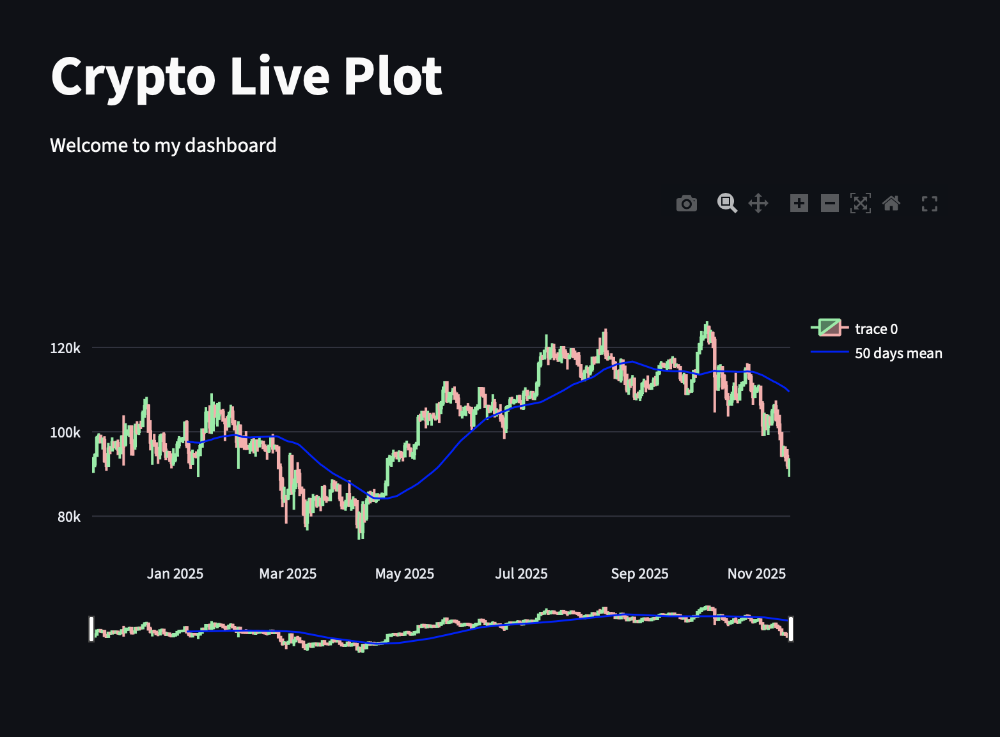

# 📈 Crypto Market Dashboard

An interactive web application for real-time cryptocurrency analysis and visualization, built with **Python** and **Streamlit**. This dashboard allows users to track price movements using professional candlestick charts and technical indicators.


*(Note: Please add a screenshot of your app here to make your repo attractive)*

## 📝 Overview

This project demonstrates how to build a financial data visualization tool using Python libraries. It fetches historical market data directly from Yahoo Finance and renders interactive charts that allow users to analyze trends and apply technical indicators like the Simple Moving Average (SMA).

## ✨ Features

* **Real-time Data Retrieval:** Fetches up-to-date crypto market data using `yfinance`.
* **Interactive Visualization:** Uses `Plotly` to render zoomable candlestick charts.
* **Technical Analysis:** Automatically calculates and overlays the 50-day Simple Moving Average (SMA) for trend analysis.
* **Dynamic User Interface:** Features a sidebar for easy currency selection (BTC, ETH, DOGE, etc.).

## 🛠️ Tech Stack

* **Python 3.x**
* **Streamlit:** For the web application interface.
* **Plotly:** For interactive charting.
* **Pandas:** For data manipulation and analysis.
* **yfinance:** For fetching financial data.

## 🚀 How to Run Locally

Follow these steps to get the project up and running on your machine:

1.  **Clone the repository:**
    ```bash
    git clone [https://github.com/WeirdBlueFish/crypto.git](https://github.com/WeirdBlueFish/Crypto-Dashboard.git)
    cd Crypto-Dashboard
    ```

2.  **Install dependencies:**
    ```bash
    pip install -r requirements.txt
    ```

3.  **Run the app:**
    ```bash
    streamlit run app.py
    ```

---
Developed by **[Your Name]**